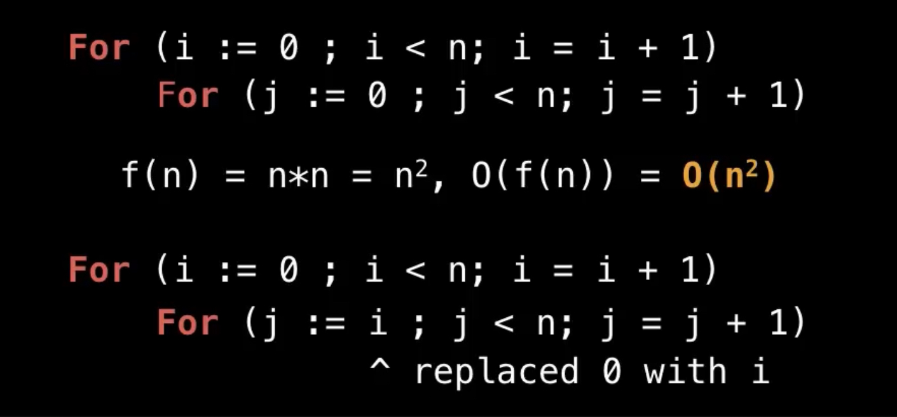

#  [[Data Structure]] [[Notes]]
	- ## Content.
		- [[ Data Structure Intro ]]
		  logseq.order-list-type:: number
		- [[Static and Dynamic array]]
		  logseq.order-list-type:: number
		- [[Linked List]]
		  logseq.order-list-type:: number
		- [[Stack data structure.]]
		  logseq.order-list-type:: number
		- [[Queue]]
		  logseq.order-list-type:: number
		- [[Heap]]
		  logseq.order-list-type:: number
		- [[Union Find]]
		  logseq.order-list-type:: number
		- [[Binary Tree]]
		  logseq.order-list-type:: number
		- [[Binary Search tree.]]
		  logseq.order-list-type:: number
	- ## [[Data Structure Intro]] .
	  collapsed:: true
		- A **data structure** is a way of organising data so that it can be accessed efficiently.
		- **Abstract Data Type** - Data type defines only how a data structure should behave and what methods it should have , but not the details surrounding how those methods are implemented.
			- Ex - List, Queue, Map, Vehicle etc.
		- ### **Intro to [[Big-O]]**
			- **Time** to  finish exec and **Space** for computation.
			- Big-O notation gives the worst case for an algorithm in terms of Time and Space That one algorithm would need.
			- 
			- #### Big-O **Properties** -
				- O(n + c) = O(n)
				- O(cn) = O(n), c > 0
				- Big-O only cares about large inputs so we can remove constants they won't increase over time.
				- f(n) = 7log(n)^3 + 15n^2 + 9
					- O(f(n)) = O(n^3)
				- Here we got O(n^3) because it the dominant term.
			- #### Big-O **Examples** -
				- The Following run in **constant** time: O(1)
					- 
				- The Following run in **linear** time O(n)
					- 
				- The Following run Quadratic time O(n^2)
					- 
					-
				- Binary Search (Divide and concur)
					- 
				- Another Example.
					- {:height 555, :width 634}
				- More Example.
					- 
					- 
				-
				-
		-
	- ## [[Static and Dynamic array]] .
		- ### Outline
			- Discussion and examples about Arrays.
				- What is an Array?
				- When and where is a Array used?
				- Complexity
				- Static array usage example.
			- Dynamic Array implementation details
			- Code Implementation
		- ### Static Array
			- It's a **Fixed Container** , **Indexable** from 0 to n-1.
			-